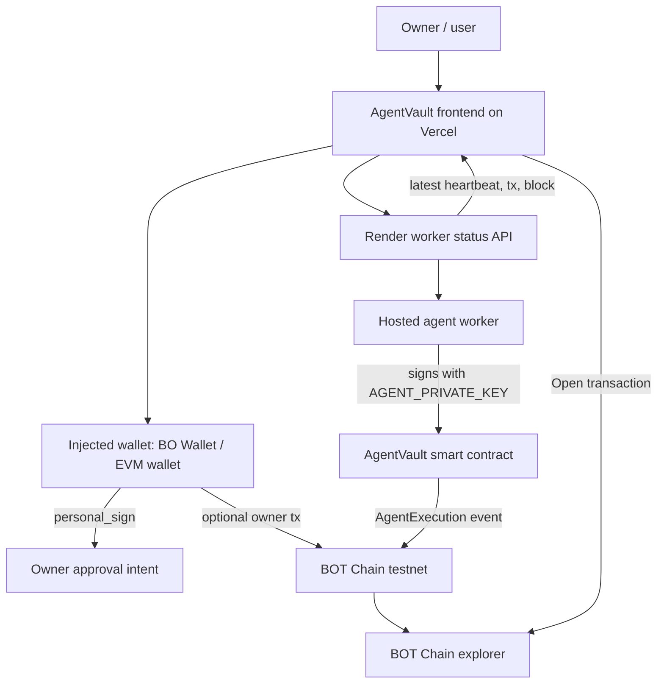

# AgentVault

Policy-bound treasuries for autonomous agents on BOT Chain.

AgentVault gives AI agents a controlled treasury they can use without taking full custody of user funds. Owners define policies such as allowed actions, daily spend limits, agent roles, and emergency pause. A hosted worker signs as the approved agent, executes through the deployed vault contract, and exposes every transaction through the app and BOT Chain explorer.

## Live Links

- App: https://agentvault-frontend.vercel.app
- Worker status: https://agent-vault-1.onrender.com/status
- Repository: https://github.com/0xNexuz/agent-vault
- BOT Chain explorer: https://scan.bohr.life

## What It Does

- Connects BO Wallet or any injected EVM wallet.
- Switches to BOT Chain testnet.
- Lets owners configure agent roles, allowed actions, daily limits, and emergency pause.
- Supports single proposal signing and one-shot policy bundle signing.
- Shows live hosted-agent activity after the browser wallet is disconnected.
- Displays latest tx hash, block number, vault address, agent wallet, and explorer link.
- Exports an audit log covering approvals, policies, manual wallet txs, and autonomous agent txs.

## BOT Chain Testnet

```txt
Chain ID: 968 / 0x3c8
RPC: https://rpc.bohr.life
Native token: BOT
Explorer: https://scan.bohr.life
```

## Architecture



## Smart Contract

The vault contract is in `contracts/AgentVault.sol`.

It enforces:

- owner-only configuration
- allowed agent addresses
- allowed action IDs
- daily spend limits
- event receipts for agent execution

Current BOT testnet deployment:

```txt
Vault: 0xacACe949cdf6f2202F2c510d5D0674af97C11b87
Agent: 0xe5ABF60A6855048fEd12938aA6C699c86C09b915
```

## Local Setup

```bash
npm install
npm run dev
```

Use `.env.example` for local environment values.

## Guided Vault Setup

This creates fresh testnet-only deployer and agent wallets, prints the public addresses to fund, deploys the vault when both have BOT, and saves the vault address locally.

```bash
npm run setup:agentvault
```

Never commit `.env` or paste private keys into chat.

## Hosted Agent

Run locally:

```bash
npm run agent:worker
```

Production worker:

```txt
https://agent-vault-1.onrender.com/status
```

The worker submits a new agent execution roughly every 60 seconds, depending on RPC and hosting latency.

## Production Build

```bash
npm run build
```

## Deploy

Frontend:

```bash
vercel --prod
```

Worker:

```txt
Build command: npm install
Start command: npm run agent:worker
```

Required worker environment variables:

```txt
BOT_TESTNET_RPC_URL=https://rpc.bohr.life
BOT_TESTNET_EXPLORER_URL=https://scan.bohr.life
AGENT_PRIVATE_KEY=...
VAULT_ADDRESS=...
AGENT_INTERVAL_MS=60000
AGENT_ACTION_AMOUNT_BOT=0
```
